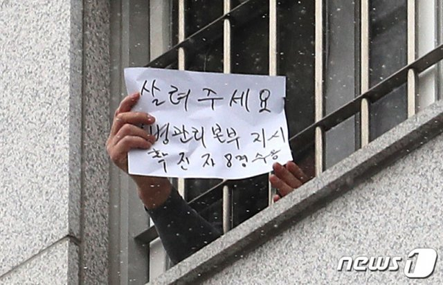

## 2024년 12월 9일

시험 1일차

과목 : 영어,사문탐

세상 할게 많다

**아니 나한테 왜이러는건데**

플레너도짜야하고 코스도 짜야하고 코딩도해야하고 인형뽑기도 만들어야하고 놀기도 해야하고 돈도 나가야하고 돈도 벌어야하고 수능도 준비해야하고 특별전형도 준비해야하고 아니 대학을 갈 수 있을진 모르겠찌만일단 해야하고아아아아아아

### 영어

영어는 어려웠다. 인생좆된거같은데

위탁 각?

### 사문탐

이거보다 쉬운 과목은 없다.

## 오늘 해야할 일

- [ ] 지구과학 개념 영상보기
- [x] 약속잡기
- [ ] 지구 학습지 풀기..

## 오늘의 명언

> 진리가 나를 인도해 주는데 무엇이 두려우랴. -간디
